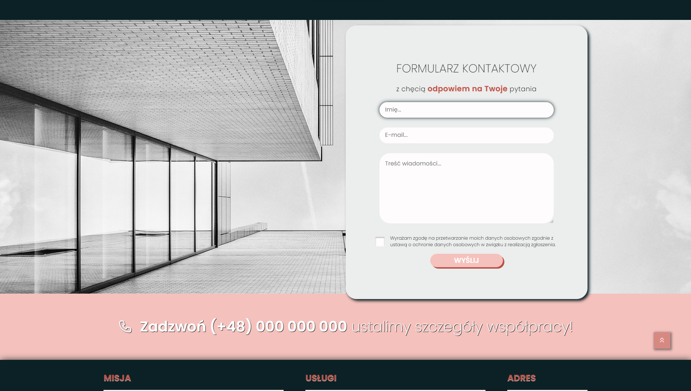
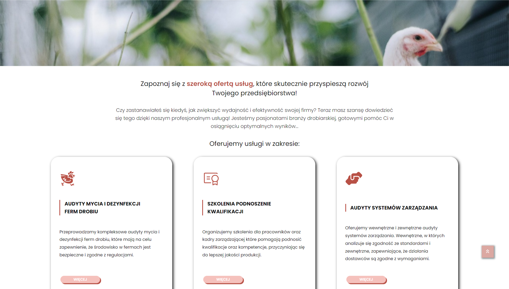

# Skill Boost Quality Website 🐔

This is the repository for the Skill Boost Quality Website project. The goal of this project is to create a website for Skill Boost Quality, a company specializing in providing innovative solutions for the food industry, particularly in the field of poultry farm audits.

You will find the source code for a dynamic website that promotes the company's services. The website showcases their expertise in delivering quality solutions for the food industry, with a specific focus on poultry farm audits.

**Website:** [https://skill-boost-quality-website.onrender.com/](https://skill-boost-quality-website.onrender.com/)

## Project Setup

1. Clone the repository to your local computer: `git clone https://github.com/JoannaPatyk/skill-boost-quality-website.git`
2. Navigate to the project directory: `cd skill-boost-quality-website`
3. Install dependencies: `npm install`
4. Run the project locally: `npm start`

## Technologies

-   HTML,
-   CSS,
-   JavaScript,
-   React,
-   Styled-components,
-   React Router.

## Getting Started with Create React App

This project was bootstrapped with [Create React App](https://github.com/facebook/create-react-app).
